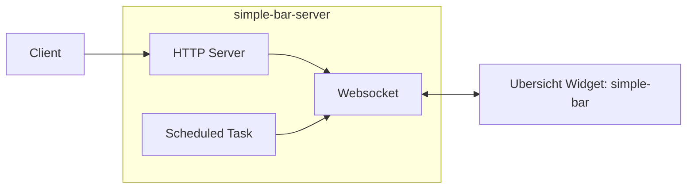

# 

## Overview

This is the server part of [https://github.com/nguymin4/simple-bar](https://github.com/nguymin4/simple-bar)

Architecture diagram:


## Features

- Refresh, toggle, enable or disable simple-bar widgets
- Refresh AeroSpace spaces, windows and displays simple-bar widgets


## Installation

Clone this project anywhere on your computer:

```bash
git clone https://github.com/nguymin4/simple-bar-server.git
```

```
python -m venv .env
source .env/bin/activate
pip install -r requirements.txt

python main.py
```

The process named `simple-bar-server`, this can be checked via `ps`, `pgrep` etc.
